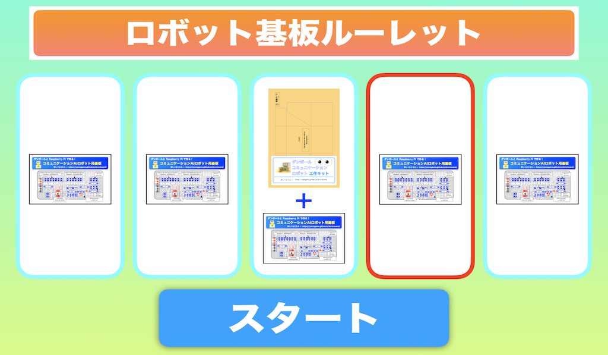

# dora-roulette

[dora-engine](https://yamagame.github.io/dora-engine) と連携して動作するルーレットプログラムのサンプルです。

<p align="center">

</p>

## 準備

[dora-engine](https://yamagame.github.io/dora-engine) が動作している Raspberry Pi で以下のコマンドを実行します。

```bash
$ git clone https://github.com/yamagame/dora-roulette
$ cd dora-roulette
$ npm install
$ npm run build
```

npm build を実行すると、アプリが build されますので以下のコマンドを実行します。

```bash
$ node server.js
```

実行したらブラウザで以下の URL を開きます。

```
http://[Raspberry Pi の IPアドレス]:4222
```

## ロボットエンジン側のスクリプト

以下のスクリプトを [dora-engine](https://yamagame.github.io/dora-engine) のシナリオエディタで実行します。

```
:LOOP
/led.blink
/wait-event
/led.off
/if/roulette-start/:START
/if/canceled/:START
/goto/:LOOP

:START
/sound.sync/Pop.wav
/http.post/http://localhost:4222/ready-roulette
/led.talk
それでは、ルーレット、スタート！
/http.post/http://localhost:4222/start-roulette
/led.on
/goto/:WAIT-STOP

:WAIT-STOP
/wait-event
/if/canceled/:PUSH-STOP-BUTTON
/if/roulette-stop/:WAIT-ROULETTE
/goto/:WAIT-STOP

:PUSH-STOP-BUTTON
/http.post/http://localhost:4222/stop-roulette
/goto/:WAIT-STOP

:WAIT-ROULETTE
/led.off
/sound.sync/Pop.wav
:WAIT-ROULETTE-2
/wait-event
/if/big-hit/:BIG-HIT
/if/hit/:HIT
/goto/:WAIT-ROULETTE-2

:BIG-HIT
/sound/muci_fan_06.wav
/3s
/led.talk
おめでとうございます。
大当たり
ダンボールロボットキットをお持ち帰りください
/goto/:LOOP

:HIT
/sound/muci_fan_06.wav
/3s
/led.talk
おめでとうございます。
当たりです。
ダンボールロボット基板をお持ち帰りください
/goto/:LOOP
```
